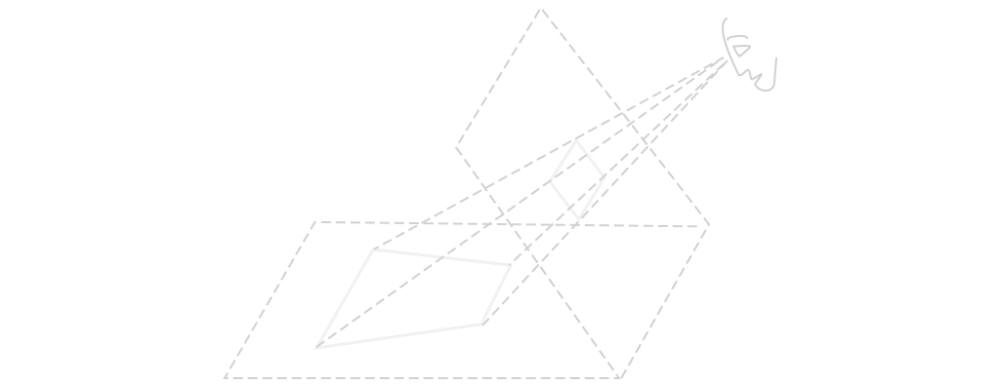

# Visual Rhetoric (1814)
## Situation and Context

### Perception
Studies of business and technical communication have long recognized the special deceptive potential of visual communication and have identified a range of deceptive and misleading techniques including improper scaling, axis changes, data omissions, and truncating to name a few. In one study, John Courtis (1997) examined more than 1,300 data displays in the annual reports of public companies in Hong Kong and found 52% of all graphics to be misleading. 

In recognition of this, Edward Tufte (1983) developed his famous “Lie Factor” to determine the ratio by which a chart distorted the data, and Steinbart’s (1998) graph-discrepency index did much the same thing. As another example, Kostelnick (2008) identified estimations of area, volume, shading and depth, as well as when interfered with by visual noise (such as insufficient figure-ground contrast) (p. 475) as potential causes of deceptive results. The moiré pattern in the figure below demonstrates and even stronger visual effect: a full-blown optical illusion complete with shimmery colors.

Aside from this, much of our understanding of how visual designs are perceived comes from the understandings of Gestalt psychology, particularly those that have to do with the process of interpreting visual stimuli we call seeing. However, we must first dispense with the naive misconception that the eye, like a camera, simply records all the material data it receives. As Rudolf Arnheim (1954/1997) wrote “vision is not a mechanical recording of elements but rather the apprehension of signifi­cant structural patterns” (p.6), structural patterns which can guide or mislead, our interpretation.

Once we no longer tether visual perception to a strictly corresponding reality, we realize “the shape of an object we see does not… depend only on its retinal projection at a given moment . . . the image is deter­mined by the totality of visual experiences we have had with that object, or with that kind of object, during our lifetime” (p. 47). This can lead to some startling results, such as the fact that we routinely edit out the appearance of our own noses in our visual field, as well as how we automatically straighten curved lines. Arnheim wrote “the eye is not corrected for spherical aberration, and yet straight lines do not look curved” (p. 69).

Studying Arnheim’s work, as relevant in the digital age as ever, we find there is a kind of double deceit required to produce faithful representations: first the artist’s eye must be deceived in seeing the object, and second the artist’s drawing must deceive the eye of the viewer. While pictorial representation may capture a truthful percept of the original object, it is by no means necessary and often instead counterproductive. Consider the example in the figure above, where the viewer perceives only the simplest shape possible based on the information available. The configuration quite natural “yields an untruthful image” Arnheim (1954/1997, p. 272).

The idea that world as we see it is not the world as it is is fundamental to understanding the mechanism of dark patterns. Aside from these two primary understandings, Gestalt principles such as the law of similarity, the law of continuity, the principles of closure, of good figure, and of figure-ground are also necessary for analysis of the visual dimension dark patterns exploit. The next sections are concerned with the dark patterns in design and rhetoric, and metis, or cunning intelligence itself, but the the perceptual understandings derived from Arnheim will arise again when analyzing specific deceptive interfaces in the pages to come.

### Weaponization
In studies devoted to the design of interactive systems, to video game development, and to human-computer interaction, research has been fairly unanimous in condemning dark patterns, expressing concerns they compromise users’ privacy (Christoph Bosch, Benjamin Erb, Frank Kargl, Henning Kopp & Stefan Pfattheicher, 2016), negatively impact users’ finances (Jose Zagal, Staffan Bjork & Chris Lewis, 2013), and their levels of attention and engagement (Saul Greenberg, Sebastian Boring, Jo Vermeulen, & Jakub Dostal, 2014).

Scholars have pointed to dark patterns as indicative of the need for widespread and sustained discussion of ethics in interaction design (Colin Gray, Yubo Kou, Brian Battles, Joseph Hoggatt, & Austin Toombs, 2018) and user experience design (Madison Fansher, Shruthi Sai Chivukula, and Colin Gray, 2018), and most have characterized dark patterns in negative terms, calling them variously “unethical” (Zagal, Bjork & Lewis, 2013, p. 3), “manipulative” (Bocsh et al. p. 241) and even “evil” (Gray et al., 2018, p.4). 

Technological rhetoric in particular has made significant contributions to these studies, documenting the effects of the technology outside of the interface, as it were. Perhaps the first to write directly about the rhetorical effects of dark patterns, Michael Trice & Liza Potts (2018) studied the infamous GamerGate hoax and found how dark patterns built into the design of Twitter’s platform were leveraged to artificially amplify alt-right rhetoric (p. 3). “GamerGate,” the authors wrote “trapped both its unwilling targets and willing participants in an unending cycle of rhetorical invention through a *mechanism* . . . ” (p. 2, emphasis added), highlighting compactly the role of rhetoric as invention, the existence of a trap, and the reliance of that trap on a mechanical contrivance of some kind—themes this webtext will echo.

Michael Trice (2019) continued to build on the rhetorical character of dark patterns in terms of *ethos* by describing “an ethic of knowledge disruption” (p. 107) resulting from the rhetoric of the technical platforms which support digital activism and the ensuing exploitation of the platforms’ vulnerabilities carried out by (again) Russian State-sponsored actors engaging in calculated campaigns of dis- and misinformation. While a “democratic ideal” may in theory be “obtainable through proper platform design and governance” (p. 106), Trice finds in GamerGate the opposite: that platform design and governance were used to prevent that democratic ideal from being realized.

### Privacy and Profit
In similar vein but regarding a different aspect of dark patterns, John Gallagher (2019) wrote of what he termed ‘dark interactions,’ which he described as “the reverse of . . . dark patterns” (p. 159). Dark interactions, he explained, are characterized by the ways “interfaces enable, encourage, and coerce users to provide information about themselves on a recurring basis” (p. 160) and were used for intelligence-gathering purposes—in other words, for surveillance conducted both by governmental and non-governmental organizations.

Aside from gathering intelligence and selling it, dark patterns can be used to influence behavior and generate profit, a point noted by technical communication scholars Gustav Verhulsdonck and Nadya Shalamova (2020), who wrote of the “risk that designers are pressured to create dark patterns that benefit the business aspect, but not the end user” and explained how the “practice raises ethical concerns for UX designers and technical communicators” (p. 196). Indeed, even when dark patterns are not being used to justify invasions, architecting attempted coups, or fomenting violence between protestors and counterprotestors, they are engaged in mere profiteering.

Finally, there has been important recent work in legal scholarship, including significant experimental results published by Jamie Luguri & Lior Strahilevitz (2021) which, the authors claimed, for the first time “demonstrates the effectiveness of various dark patterns” (102). These results gave quantifiable weight to their suggestion that “certain kinds of dark patterns . . . can be so powerful in and of themselves . . .” that they should cause the “FTC to conclude. . . [they are] presumptively deceptive or unfair” (p. 98). In other words, from a legal perspective, these scholars argue that some kinds of dark patterns are so provably deceptive they may therefore already be illegal.

Luguri & Strahilevitz (2021) also warned of the corrosive effects dark patterns have when supported by modern automation and data infrastructure that provides the ability “to refine and perfect dark patterns.” They wrote: “By running tens of thousands of consumers through interfaces that were identical in every respect but one, firms can determine exactly which interface, which text, which juxtapositions, and which graphics,” concluding that, as a result,  “consumers’ ability to defend themselves has degraded” (p. 103). The digital nature of dark patterns makes them highly adaptable and correspondingly more difficult to combat. 

### Rhetorical Cunning
According to the legends of Hesiod and Ovid, the goddess Mêtis was the daughter of Tethys. As an ocean goddess, she was a shapeshifter and her divine portfolio included counsel, wisdom, and trickery. Her story is perhaps not as well-known as others in the pantheon, but Mêtis was Zeus’ first wife and it was she who authored the ploy by which Zeus bested Chronos and inaugurated the Olympian age.

Afterward, Zeus learned that Metis’ progeny would one day overthrow him as he'd overthrown his own father, so he tricked her into assuming the form of a fly and swallowed her, consuming her power to become “himself pure mêtis” (Marcel Detienne & John-Paul Vernant, 1978/1991, p. 14) which ensured his eternal dominance over gods and men.

However, Mêtis was pregnant. The unborn child eventually sprang from Zeus’ brow “arrayed in arms of war” ([Hesiod, ln.901](http://www.perseus.tufts.edu/hopper/text?doc=Perseus:abo:tlg,0020,001:927)). Athena, chief goddess and patron of the arts, whether advising in stratagems or teaching crafts, perhaps most directly inherited the gifts of Mêtis that Zeus had tried to keep for himself.

To see *metis* properly, then, we must recover what Janet Atwill (1998/2009) called a “neglected tradition of rhetoric embodied . . . in Protagoras’ political tēchne and Isocrates’ logon tēchne and preserved, in somewhat modified form in Aristotle’s <cite>Rhetoric</cite>” (p. 1). While similar in many ways to the feminist rhetorical project of Susan Jarrett (1998), Atwill's is more explicitly about reclaiming techne and thus relates closely with metis. 

In Atwill’s feminist reclamation, *metis* plays a central role because it “transgresses boundaries” with its “transformative power” (p. 56).  Useful in “situations which are transient, shifting, disconcerting, and ambiguous,” the ability to change form gives it the flexibility to address always shifting circumstances and enables the “significance of *techne*” (Atwill, 1998/2009, p. 56). 

Scholars, including Debra Hawhee (2002) and Jay Timothy Dolmage (2009 and 2014) have emphasized the physical, embodied character of *metis*, while still others, such as Karen Kopelson (2003), and Erin Brock Carlson (2018) have examined its pedagogical relevance. Thomas Rickert (2014) studied its relevance to classical, pre-Sophistic rhetoric.  All of these scholars have written of the central importance of *metis* to various feminist concerns, but *metis* is especially relevant when it comes to rhetorics of embodiment.

### Embodiment
In a landmark work, <cite>Disability Rhetoric</cite>, Dolmage (2014) draws extensively on queer theory and feminist rhetorics of embodiment to illuminate the rhetoric of bodily expression: not only how bodies are represented but also how they can be at once marginalized, objectified, empowered and treated with equity. Dolmage writes extensively of *metis* both as a concept and as a mythological figure, as a goddess and as an idea. It’s here that one can see most fully the idea that the myth of Metis is synecdoche for femininity in rhetoric.

Perhaps in the most significant contribution to the literature on *metis*, Dolmage brings in the story of Medusa, a figure who has come to be seen as representative of feminism. Having noted in particular that “Medusa’s snakelike head was a direct symbol of her cunning, calling up the curving and polymorphism of mētis” (p.207), Dolmage went on to write how Medusa, is “a symbol of female embodiment and oftentimes a symbol of the stigma and confusion around, and the powerful, sometimes violent challenges to, women’s embodied rhetoricity” (p. 208) and figures the stoning power of Medusa’s gaze as the power of rhetoric to fix and freeze others.

Aside from the snaky hair and the stoning gaze, Dolmage also describes the feminine attributes of “artful eloquence” and “rhetorical ornament”  and juxtaposes these with the “grisly” story of Medusa’s death and its depiction in ancient art, finding there support for the feminist project of Hélène Cixous, her “reclamation of cunning” (p. 208), in which the story of Medusa shows how women have been driven away from writing their stories “as violently as from their own bodies” (p. 210)—an alienation from self that contributes to and furthers the process of othering. 

From this perspective, Dolmage wrote, the “driving away from the body resonates with Zeus’s consumption of Metis and the condemnation of bodily intelligence (and of the bodies of cunning intelligence) encouraged by the tradition we have chosen” (p. 210). While for Atwill (1998/2009), the rhetorical tradition has “neglected” (p. 1) *metis*, for Dolmage, the tradition has actively consumed *metis* through violent appropriation and in so doing severed femininity from womanhood like Medusa: “freezing of us all before the specter of the feminine” (Dolman, 2014, p. 208).

Important recent studies of *metis* come with Erin Brock Carlson’s conception of it as a technofeminist intervention (2019) for use in larger projects of rhetorical activism and rhetorical listening, as well as a feminist-inspired method for participatory research (2020) in communities. Carlson (2019) wrote how “*metis* helps bodies navigate those structures [of inequity] by deploying a range of resources, including physical and digital tools” (p. 2). 

Carlson (2019) developed a coherent framework for metis that not only figures it as a powerful feminist method of engagement, writing how it is most useful “as a collaborative tool in social movements” but also as a uniquely social metholdology “especially helpful in digital spaces” because it is essentially “a melding of bodies and minds” (p. 16) Like other, Carlson also saw *metis* as having been disrupted in the rhetorical tradition and wrote that “this erasure” consequently “casts metis as a singular power, isolated from other elements or actors” (p. 16), ironically strengthening what the masculine intended to destroy.
