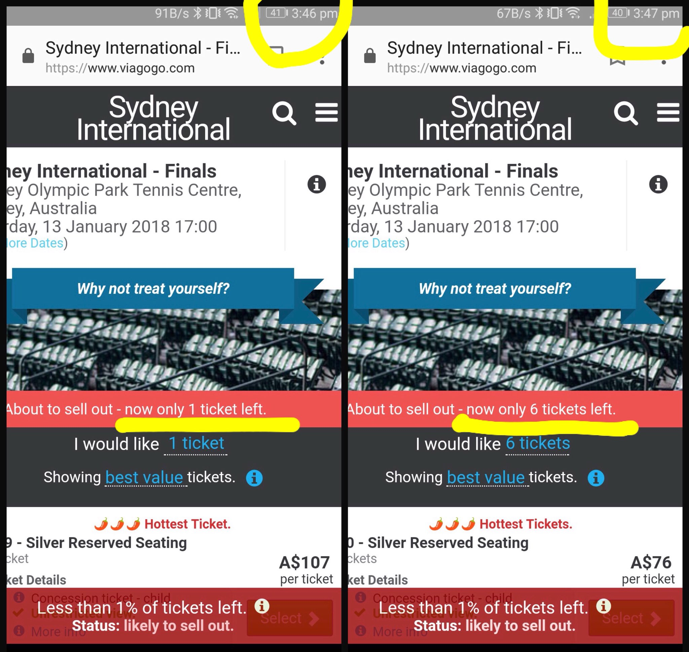

# Patterns <em>of</em>Timing
## Vigilance <em>and</em> Opportunism

### Timing
Patterns in this category rely on hacking time in some fashion, either by playing with users’ sense of time, changing things over the course of time, or overwhelming users with a large number of actions that would require a significant investment of time. Despite the transparency of these effects, they are some of the more commonly encountered.

. This archetype shows a portion of the 350+ toggles that must be individually adjusted to opt out of all data brokering services the user is otherwise enrolled in.](../bin/img/1time.jpg)

Nothing in the interface has been hidden or transformed, instead what had seemed a simple task (opting out) has been turned into an extremely tedious and time-consuming one; and an interface ostensibly designed to assist users is revealed as actively hostile.

The sheer number of switches that must be toggled to unsubscribe totally from the service amounts to a kind of emotional intimidation. “Don’t even try it,” the interface seems to snarl. The regular relationship with the text has been reversed: instead of the interface as a helper, or as pretending to help at least, this interface is overtly threatening and malignant.

UX designers will be familiar with Hick’s Law which holds that “the time it takes to make a decision increases with the number and complexity of choices” (Yablonski, 2019). For each item on the list, each other item becomes measurably more difficult to track. From a visual and informational design perspective, this list is the equivalent of a cadre of thugs showing up to muscle you out of your money.

### Kairos
An essential characteristic of mêtis is its vigilant opportunism, and kairos is its rhetorical counterpart. Since the realm where mêtis applies is an antagonistic one with opposing forces striving against each other, mêtis “operates on a shifting terrain, in uncertain and ambiguous situations” (Detienne and Vernant, 1974/1998 p. 14). Being cunning in such circumstances involves not only watchfulness, but, when the moment comes, sudden motion, and so it also requires knowledge both about the factors involved as well as the likely progression of events.

That this aspect of mêtis is closely related to “the term *kairos*, opportunity,” the authors noted, “although in a form which we must define more closely” (p. 15). The kind the authors mean is not mere recognition of the kairic moment, but rather mastery over it. Detienne and Vernant wrote mêtis “can seize the opportunity in as much as… it has been able to foresee how events will turn out and to prepare itself for this well in advance” (p.16). 

. This variant intimidates users with un-deletable calendar events lasting five years, reminding users to re-subscribe every three months.](../bin/img/2time.jpg)

Thus, acting with mêtis means learning from the past, inhabiting the present, and manipulating the future beforehand. It means occupying the right positions in both space and time. This example shows how the dark pattern designer is so far ahead of the user, five years, that time can be leveraged for gain.

### Space
This union of space with time is captured in the rhetorical concept of *kairos*, which, after long neglect, has been enjoying a decades-long revival in issues of agency (Herndl and Licona, 2004), religion (Crosby, 2011), and the rhetoric of science (Miller, 2013), among others. Much of modern rhetorical conceptions of kairos are drawn from Sippiora and Baumlin (2002) and ultimately from E.C White (1987), who derives the roots of the word from both archery and weaving, describing kairos as “a passing instant when an opening appears which must be driven through with force if success is to be achieved” (p.13).

](../bin/img/3time.jpg)

In the snail mail variant in the figure above, the force is again the threat of costing time. Having to stop one’s electronic communication to obtain printouts, envelopes, stamps, and mail service in order to opt-out of an email subscription puts numerous formidable barriers in the way of canceling.

### Changes
The metaphor of an opening, a window of time, and the movement necessary to clear it, whether by arrow or shuttle, again blurs the distinction between the mechanical and the discursive, allowing the archer, the weaver, or the rhetor to overtake the swiftly passing moment, as Detienne and Vernant wrote, “It is mêtis which, overtaking the kairos, however fleeting it may be, catches it by surprise” (p.16).

Such ability allows designers to take advantage, as in this variant, showing two screenshots taken a minute apart. In the second, later shot, there are a different number of tickets available, and there are more of them. This creates an artificial sense of urgency that activates a user’s fear of missing out. 